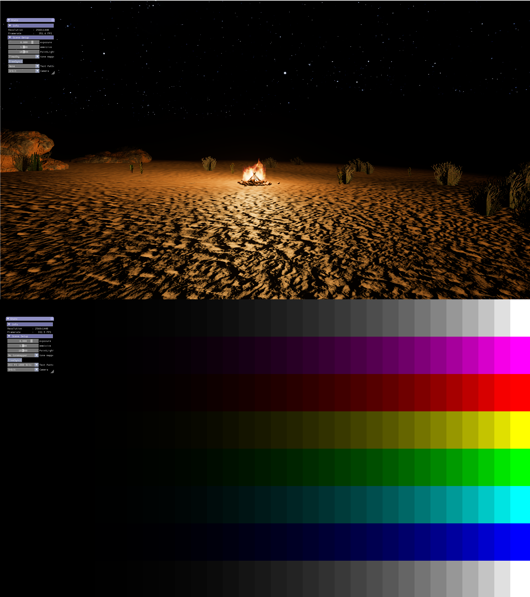

# AMD Freesync Premium Pro Sample

### Sample Overview:

- This sample is meant to show Freesync Premium Pro (FS2 here after) integration into DX12 and Vulkan API.
- Please read GPU Open blog post on FS2 for a complete understanding of the code sample.
- There is also documentation covering:
    - [Colour spaces](https://gpuopen.com/using-amd-freesync-2-hdr-color-spaces/)
    - [Tone mapping](https://gpuopen.com/using-amd-freesync-2-hdr-tone-mapping/)
    - [Gamut mapping](https://gpuopen.com/using-amd-freesync-2-hdr-gamut-mapping/)



# Build Instructions

### Prerequisites

- Get a FS2 monitor and update its firmware to latest. Follow the monitor manufacturer's guide.
- In monitor panel settings:
    - Set freesync to ultimate engine (This setting is monitor specific. Set this to the "highest" freesync setting available on the monitor panel).
    - Set local dimming to auto if local dimming support is present.
- Get latest AMD drivers.
- Turn freesync on, in display tab in radeon settings.
- To build FS2 Sample, install the following tools:

    - [CMake 3.4](https://cmake.org/download/)
    - [Visual Studio 2017](https://visualstudio.microsoft.com/downloads/)
    - [Windows 10 SDK 10.0.17763.0](https://developer.microsoft.com/en-us/windows/downloads/windows-10-sdk)
    - [Vulkan SDK 1.1.106](https://www.lunarg.com/vulkan-sdk/)

#### Running the FS2+HDR Sample:

- Clone the repo with its submodules:

  ```
    > git clone https://github.com/GPUOpen-LibrariesAndSDKs/FreesyncPremiumProSample.git --recurse-submodules
  ```

- Generate the solutions:

   ```
    > cd Freesync2Sample\build
    GenerateSolutions.bat
   ```

- Open the solutions in the VK or DX12 directories, compile and run.
- The app will start in windowed SDR mode.
- Freesync and HDR do not work in window mode. You need to be in fullscreen exclusive mode. Enter fullscreen by pressing alt + enter.
- Once in fullscreen, use in app UI Display mode option to select one of the following modes:
    - FS2 Gamma2.2
    - FS2 scRGB
    - HDR10 ST2084
    - HDR10 scRGB
- Toggle local dimming from in app UI check box. Local dimming should be supported on display and it only works on FS2 modes.

### High-level overview:

Freesync2.cpp:
- Querying for FS2 display support and display metadata.
- Setting display settings through AGS for DX12 and through vulkan extensions for VK.
- Support for 8 bit, 10bit and 16bit swapchain format based on display mode selected.
- Every time display mode is changed, swapchain needs to be recreated and we need to call set display settings through AGS or the vulkan extensions.
- We also need to recreate the render target view as swapchain format changes.

ColorConversionPS.cpp:
- The final fullscreen pass that writes to swapchain.
- Format must match the display mode and the swapchain.
- Perform the final modifications in ColorConversionPS.hlsl/glsl to the output colour coming out of the tonemapper.

FS2 Gamma 2.2 mode modifications to output:
- Swapchain Format: DXGI_FORMAT_R10G10B10A2_UNORM or VK_FORMAT_A2R10G10B10_UNORM_PACK32
- Colour Space: AGSDisplaySettings::Mode::Mode_Freesync2_Gamma22 or VK_COLOR_SPACE_DISPLAY_NATIVE_AMD
- Gamut: Display Native
- App side Transfer Function: Inverse Gamma 2.2
- Colour channel range: [0, 1], where RGB(1, 1, 1) maps to max nits the display can support.
- Display performs gamma 2.2 and nothing else. It is our responsibility to transform to display native gamut from our content authored colourspace.

FS2 scRGB mode modifications to output:
- Swapchain Format: DXGI_FORMAT_R16G16B16A16_FLOAT or VK_FORMAT_R16G16B16A16_SFLOAT
- Colour Space: AGSDisplaySettings::Mode::Mode_Freesync2_scRGB or VK_COLOR_SPACE_DISPLAY_NATIVE_AMD
- Gamut: scRGB with rec709 primaries
- App side Transfer Function: None
- Colour range: [Min Display Luminance / 80, Max Display Luminance / 80], where RGB(Max Display Luminance / 80, Max Display Luminance / 80, Max Display Luminance / 80) maps to max nits the display can support.
- The display, gamut transforms from rec709 to display native primaries and compresses colour range from 16bit float [Min Display Luminance / 80, Max Display Luminance / 80] range to [0, 1] range. Out of gamut values beyond rec709 range but within display gamut range get mapped accordingly, and the ones that lie beyond the display native gamut get clamped. No curve is applied.

Understanding Display metadata:
- When in FS2 mode, we set the chromaticity and luminance values to be the same as what we query through AGS or Vulkan extensions.
- When in HDR10 mode, we set the chromaticity values to rec2020 primaries and luminance values can be above what the display supports up till HDR10 spec of 10,000 nits.
- Now it is upto the display to tonemap and gamut map on its end using MAXCCL and MAXFALL values set in the metadata. This tonemapping is display dependent and the look of the final scene can change accordingly and developers don't have control over it.

Display Properties:
- The FS2 displays are different in the sense that the quried chromaticity and luminance values returned from the display are certified by AMD to be resonably close to actual values.
- However, we need to understand how they are measured with regards to local dimming option, to correctly target the display range.
- The max luminance value of the display range is measured with a 10% white quad against a black background. This value is not representative of the max luminance of the display, when we have for example a fullscreen white quad.
- FS2 HDR is all about seeing the colours and brightness levels we send through the final swapchain buffer, and to get the most accurate and representative image of the swapchain framebuffer on the screen, one should turn local dimming off. However it should be important to remember that in the event the game scene fits the conditions of local dimming zones like one 10% area in the scene is bright and rest of the scene is dim, you will lose out on peak brightness values the display can support.
- One should also be aware that the colour volume formed by the red, green and blue chromaticity, converge towards the white point at different rates. For example, the blue chromaticity point is the first to peak in brightness and the only way to make it brighter, is to sacrifice its hue by adding red and green to it making it move slightly towards white.
- And lastly, you do not get any control over what the display does to the final frame buffer output in SDR and HDR10 modes. It is quite possible for SDR mode to take for example a rec 709 red point and expand it to the display's redpoint. This might make the result more visually appealing as you will see a more vibrant red, but it will be wrong in terms of correctness of the authored content.